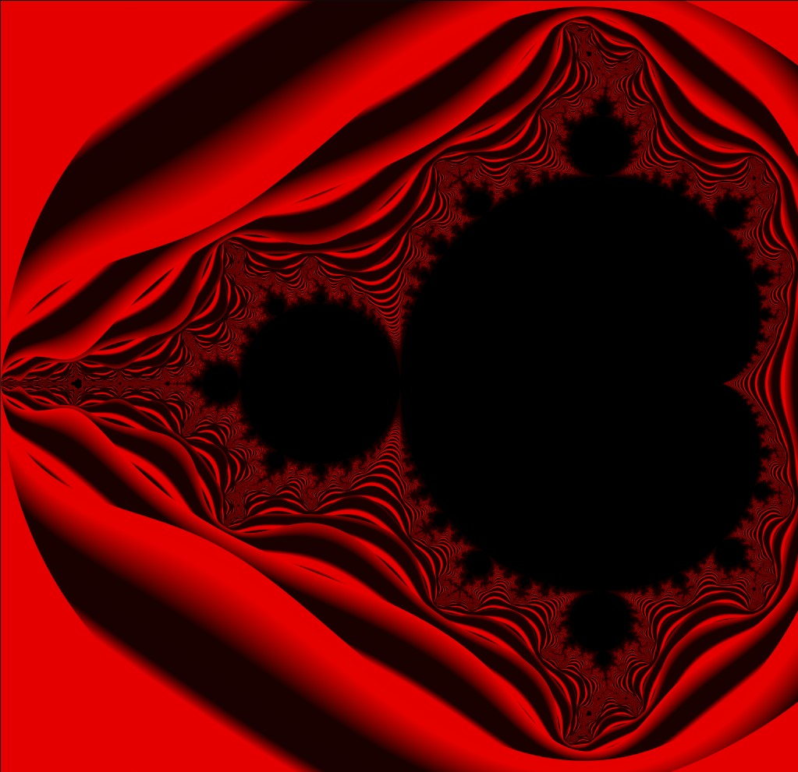

# GoFRACTALS
Just some cool stuff that exploits the go-routines

Since many people don't know what a fractal is 
Here's an ELI5 explanation for you:
## What's a FRACTAL?
<pre>Imagine drawing a picture that has the same pattern or shape, no matter how much you zoom in. That's a fractal! Fractals are intricate and repeating patterns found in nature and can also be generated using mathematical formulas.
They exist in the nature naturally and are a very scientific and necessary adaptation.
For Example: Ferns,Snowflakes, shapes of galaxies etc.
In other words every pixel of the object/diagram adheres to the exact same topography
</pre>
 

## Which Fractal have I rendered here?
<pre>I've rendered a Mandelbrot Set , which is one of the most famous examples of Fractals there is.
It is named after the famous mathematician Benoit Mandelbrot.
It's created by repeatedly applying a mathematical formula to each point on a complex plane. 
</pre>
 

## What's the code doing?
<pre>
Well, you have to be generating this concurrently.
And also follow the below steps:

Define a complex plane: A complex plane is like a grid where each point has a real and an imaginary value. In simple terms, it's a way to represent numbers that can have both real and imaginary parts.

Iterate through each point: Start with every point on the complex plane and repeat a calculation for each point.

Apply the iteration formula: The iteration formula involves squaring the previous result and adding the original point's coordinates. This process is repeated multiple times, and the result is checked at each step.

Assign colors: Based on the number of iterations it takes for the result to become "unbounded" (a value that gets infinitely large), assign colors to the points on the complex plane. 
</pre>
 

## Applications of observing and understanding Fractals?
<pre>
1. Fractals are extensively studied in mathematics and have applications in areas such as chaos theory, dynamical systems, and nonlinear dynamics. The Mandelbrot set, Julia sets, and the Sierpinski triangle are well-known mathematical fractals.

2. Fractals can be observed in natural phenomena such as the branching patterns of trees, the shapes of clouds, the structure of coastlines, and the behavior of fluid turbulence. Fractals are also used in modeling complex systems like the behavior of galaxies or the distribution of matter in the universe.

3. Fractals find applications in computer graphics, where they are used to generate realistic landscapes, foliage, and other natural elements. Fractal algorithms like the Diamond-Square algorithm or the Fractal Brownian Motion are used in procedural generation of terrain or textures.

4. Fractal-like patterns are found in biological systems, including the branching structures of blood vessels, the arrangement of leaves on plants, the patterns on seashells, and the structure of lungs and bronchial trees. Fractals are also used to model and analyze biological networks and processes.

5. Fractals have been used in modeling financial markets and analyzing price movements. The concept of self-similarity and scaling properties in fractals has been applied to understand market dynamics and predict price fluctuations.

6. Fractals have inspired artists and designers to create visually captivating works. Fractal art involves generating intricate patterns using mathematical algorithms and digital tools. Fractals have also influenced architectural design, with buildings incorporating fractal-like structures and patterns.

7. Fractals have been used in music composition and sound synthesis. Fractal algorithms can generate complex and self-similar musical patterns, creating unique and intriguing compositions.
</pre>
 

Now Let's dive deeper into why I chose Golang and what are the benefits
 
Golang's got amazing dynamically resource allocating threads known as Go-routines , which in-turn also aligned with my aspirations of studying Go :)

## How to check for yourself?
You better have the latest golang version installed and also install the pixelgl library 
Links:
<pre>
github.com/faiface/pixel
github.com/faiface/pixel/pixelgl
</pre>
Install it by running
<pre>git clone https://github.com/Kaushik268mlore/GoFRACTALS.git
</pre>
One of the renders   